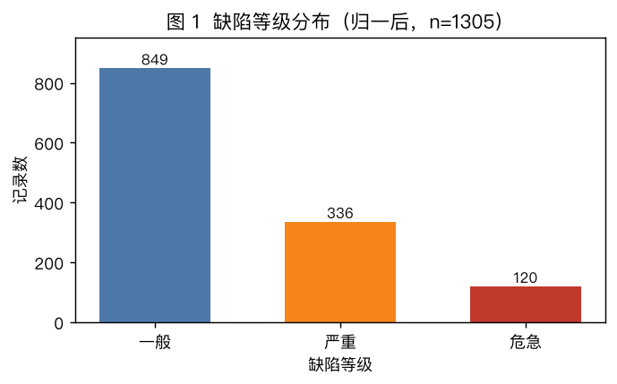
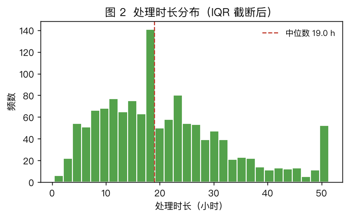
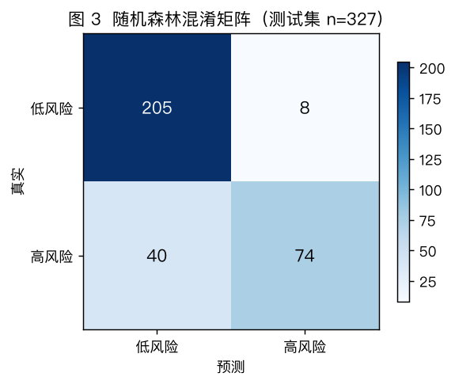
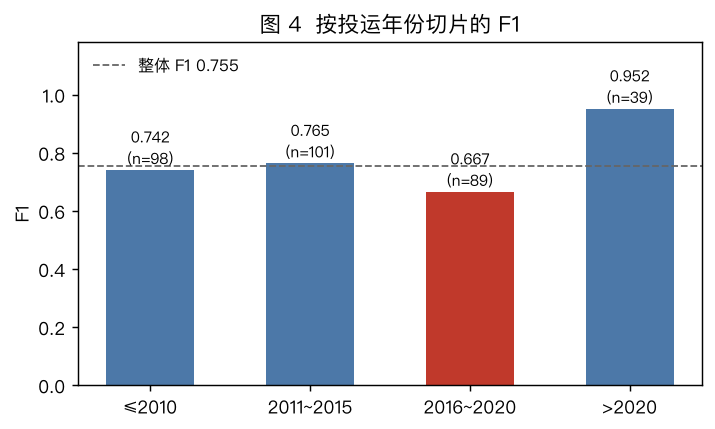

# 技术文档示例 · 配网缺陷高风险判别

> **这是一份「满分档」示范文档**，场景即 [`mock01`](./README.md)（限时 90 分钟 / 50 分）。
> 全部数字来自实跑 `mock01_solution.ipynb`，图表由同目录 `figs/` 下的真实输出提供。
>
> **用法**：先自己按 [`../../docs/技术文档撰写模板.md`](../../docs/技术文档撰写模板.md) 的骨架写一遍，
> 再对照本文逐节看差在哪 —— 重点看**数字是否都有出处**、**每个选择是否都写了依据**、**错误分析是否做了归类**。

---

## 1. 任务理解与拆解

### 1.1 业务问题 → 技术问题

**业务问题**：设备管理班组需要为新增缺陷工单**排检修优先级**，但现有记录只有人工登记的
`缺陷等级`（一般 / 严重 / 危急），缺少可批量计算的量化依据。

**技术问题**：二分类 —— 以 `缺陷等级 ∈ {严重, 危急}` 为正类，构造标签 `高风险`，
用设备台账属性与运行数据预测「该缺陷是否属于高风险」，输出可直接排序的结果。

**为什么是分类而不是回归**：业务只需要「高 / 低」两档派工，不需要连续分值；
且标签本身就是离散等级，硬套回归会引入无意义的序关系。

### 1.2 交付物清单（按分值排序，先做分值高的）

| 交付物 | 分值 | 完成 |
|---|---|---|
| 第一步 数据探索（E1~E3） | 6 | ✅ |
| 第一步 数据清洗（C1~C5） | 10 | ✅ |
| 第一步 数据可视化（V1~V2） | 4 | ✅ |
| 第二步 数据挖掘（M1~M5） | 20 | ✅ |
| 第三步 评估与调优（T1~T3） | 10 | ✅ |
| **合计** | **50** | |

---

## 2. 数据说明与质量评估

### 2.1 数据概览

| 文件 | 规模 | 编码 | 作用 |
|---|---|---|---|
| `defect_records.csv` | 1313 × 8 | **GBK** | 缺陷主表（建模主体） |
| `device_master.csv` | 288 × 5 | UTF-8 | 设备台账（提供 `设备类型` / `投运年份`） |
| `load_curve.csv` | 17520 × 4 | UTF-8 | 两个台区的全年小时负荷（本次未使用） |

### 2.2 字段定义表

| 文件 | 字段 | 类型 | 含义 | 取值范围 / 取值集合 |
|---|---|---|---|---|
| defect_records | 缺陷类型 | 类别 | 缺陷现象分类 | 渗漏油 / 异物 / 破损 / 锈蚀 / 发热 / 放电痕迹（6 类） |
| defect_records | **缺陷等级** | 类别 | 人工登记的严重度 | 一般 / 严重 / 危急（**原始 7 种写法**） |
| defect_records | 发现日期 | 字符串 | 缺陷发现日期 | 4 种格式混用，2025-01-01 ~ 2025-12-31 |
| defect_records | 处理状态 | 类别 | 工单状态 | 已处理 / 处理中 / 未处理（**原始 7 种写法**） |
| defect_records | 处理时长_小时 | 数值 | 发现到处理耗时 | 含 `9999`、`-1` **哨兵值** |
| defect_records | 负荷值_kW | **字符串** | 记录时刻台区负荷 | 混有 `"103.50 kW"`、`"1,023.60"`、`"—"` |
| device_master | 设备类型 | 类别 | 设备类别 | 8 类，**部分设备无台账** |
| device_master | 投运年份 | 数值 | 设备投运年份 | 2005 ~ 2024 |

### 2.3 质量规则（本次采用的口径）

| 规则 | 判定条件 | 命中 |
|---|---|---|
| 编码 | 按文件分别指定 | 主表 GBK / 台账 UTF-8，**不能统一按 UTF-8 读** |
| 完整性 | 关键字段非空 | `处理时长_小时` **53** 条、`负荷值_kW` **11** 条 |
| 唯一性 | 全字段完全一致视为重复 | 完全重复 **8** 行 |
| 有效性 | 数值列剔哨兵、非负、在合理区间 | 哨兵（`9999`/`-1`）**6** 条；IQR 外 **46** 条 |
| 一致性 | 同义取值归一 | `缺陷等级` **7** 种 → 3 类；`处理状态` **7** 种 → 3 类 |
| 可解析性 | 日期可解析为 `datetime` | 混用 **4** 种格式，解析失败 **0** 条 |
| 关联完整性 | 台账可关联率 | `设备编号` 关联不上 **12** 个，涉及 **42** 条记录 |

### 2.4 问题清单（按处理优先级）

1. **编码不一致** —— 主表 GBK、台账 UTF-8，统一读会乱码。
2. **日期 4 种格式混用** —— `MM/DD/YYYY` 423 条 / `YYYY/MM/DD` 390 条 /
   `YYYY-MM-DD` 369 条 / `YYYY年M月D日` 131 条，单一 `format=` 解析不了。
3. **类别别名 + 隐形空格** —— `缺陷等级` 共 7 种写法，其中 `'一般 '`（**带尾空格**）
   就有 291 条；`紧急` / `较重` 分别是 `危急` / `严重` 的同义词。
   **若只做别名映射不做 `strip()`，这 291 条会全部落成 `NaN`。**
4. **数值列被写成字符串** —— `负荷值_kW` 有 **31** 条非纯数值：带单位（`103.50 kW`）、
   带千分位（`1,023.60`）、占位符（`—`）。
5. **异常值混入真值** —— `处理时长_小时` 有 6 条哨兵值，直接进 IQR 会污染四分位数。

### 2.5 标签分布

> **图 1 缺陷等级分布（归一后，n = 1305）**：一般 849 / 严重 336 / 危急 120，
> 高风险（严重 + 危急）占比 **34.94%**，属**中度不平衡**。
> 该比例决定了后续评估**不能只看准确率**（全预测为负类即可得 0.65 准确率）。

---

## 3. 处理方法与选择依据

| 问题 | 采用方法 | 依据 | 代价 / 被放弃的备选 |
|---|---|---|---|
| 完全重复 8 行 | 全字段去重（**关联台账前**） | 重复会让后续统计量偏大 | 放在关联后做会放大成 8×N 行 |
| 两列缺失（处理后共 69 条） | 中位数填充 | 两列均右偏，均值被尖峰拉高 | 备选：按台区分组中位数（更准，但依赖台账覆盖，本次不满足） |
| 哨兵 6 条 + IQR 外 46 条 | **先剔哨兵，再 IQR 截断** | `9999` 是占位符不是观测值，直接进 IQR 会把上四分位抬高 | 备选 3σ：对偏态分布不如 IQR 稳健 |
| 类别别名 | `.str.strip()` 后按映射表归一 | 不归一会把同一类拆成多类，虚增类别数 | — |
| 负荷值字符串 | 剥单位 → 去千分位 → `to_numeric(errors="coerce")` | 直接 `astype(float)` 会抛错中断流程 | 代价：不可解析值变 NaN，需并入缺失流程 |
| 特征编码 | 类别 One-Hot，数值 StandardScaler | 逻辑回归对量纲敏感 | 树模型不需要标准化，但**共用同一条流水线**更不易踩泄漏 |
| 划分 | 分层抽样 3:1，`random_state=42` | 保持训练/测试正类比例一致（0.3497 vs 0.3494） | — |

> **一个必须写出来的副作用**：中位数填充在 `处理时长_小时 = 19.0 h` 处
> 堆出一个人工尖峰（下图 2 最高柱，140 频次）。
> 这不是真实分布特征，而是**填充痕迹** —— 报告里如实说明，避免后续误读。

> **图 2 处理时长分布（IQR 截断后）**：中位数 19.0 h；
> 19 h 处的尖峰为填充引入，右尾经 IQR 截断至 51.35 h。

---

## 4. 实现关键步骤

- **环境**：Python 3.13 / pandas 3.0.6 / scikit-learn 1.9.1
- **随机性控制**：全局 `random_state = 42`（划分、模型、交叉验证全部固定）

**流程**

1. 主表按 GBK、台账按 UTF-8 读取；主表全字段去重（删 **8** 行 → 剩 **1305** 行）
2. 负荷值剥单位 / 去千分位 → `to_numeric(errors="coerce")`（转出 **16** 条 NaN）
3. 日期按 4 种格式逐格式回退解析（失败 **0** 条）
4. 类别 `.str.strip()` 后按映射表归一（7 种 → 3 类）
5. 中位数填充（**69** 条）→ 剔哨兵（**6** 条）→ IQR 截断（**46** 条，界 `[-12.25, 51.35]`）
6. `left join` 台账（**42** 条关联不上 → `设备类型` 填 `未知`）
7. 构造标签 `高风险`（正类占比 **0.3494**）→ **分层**划分 3:1（训练 **978** / 测试 **327**）
8. **先划分、再拟合编码器与标准化器**（防数据泄漏）
9. 训练逻辑回归与随机森林；`GridSearchCV(cv=3)` 调参

**关键参数**

- 随机森林：`n_estimators=200`，其余默认
- 逻辑回归：`max_iter=1000`
- 网格：`n_estimators ∈ {100, 200}` × `max_depth ∈ {8, 14, None}`，评分 `f1`

> **防泄漏的关键一步**在流程 8：若先对全量数据 `fit_transform` 再划分，
> 测试集的均值/方差信息会通过标准化器泄漏到训练过程，指标会虚高。

---

## 5. 结果与分析

### 5.1 总体指标（测试集 n = 327）

| 模型 | 准确率 | 精确率 | 召回率 | F1 |
|---|---|---|---|---|
| 逻辑回归 | 0.8440 | 0.9315 | 0.5965 | 0.7273 |
| **随机森林** | **0.8532** | 0.9024 | **0.6491** | **0.7551** |

> **图 3 随机森林混淆矩阵**：TP 74 / FP 8 / FN 40 / TN 205。
> 误差**集中在漏报**（40 例），远多于误报（8 例）。

### 5.2 基线对照

| 基线 | 准确率 | F1 |
|---|---|---|
| 全预测为正类 | 0.3486 | 0.5170 |
| 全预测为负类 | 0.6514 | 0 |
| 逻辑回归 | 0.8440 | 0.7273 |
| **随机森林** | **0.8532** | **0.7551** |

随机森林 F1 比朴素基线（全正类）高 **0.2381**，模型确实学到了信号。
但**准确率会高估模型**：相对「全预测负类」基线只高出 0.2018，而 F1 从 0 提到 0.7551 ——
**同一套模型，用哪个指标看，结论的"漂亮程度"完全不同**。

### 5.3 切片分析

| 切面 | 样本数 | 准确率 | F1 | 观察 |
|---|---|---|---|---|
| 投运年份 ≤ 2010 | 98 | 0.8367 | 0.7419 | 略低于整体 |
| 2011 ~ 2015 | 101 | 0.8416 | 0.7647 | 表现最好 |
| **2016 ~ 2020** | 89 | 0.8315 | **0.6667** | **最弱切面** |
| > 2020 | 39 | 0.9744 | 0.9524 | 样本仅 39，结论不稳健 |

> **图 4 按投运年份切片的 F1**：2016~2020 投运设备明显低于整体（0.755）。

**结论**：模型在 **2016~2020 投运**的设备上 F1 仅 0.6667，不建议直接按模型分派工单，
该切面需人工复核。

---

## 6. 问题与改进

### 6.1 错误案例归纳

测试集 327 条中误分类 **48** 条。按真实标签拆开：**正类错 40 条、负类错 8 条** ——
误差**高度集中在漏报**（40 / 48 = 83.3%）。

| 类别 | 占比 | 特征 |
|---|---|---|
| **A. 正类漏报** | 40 / 48 | 114 个真实正类漏判 40 个（召回 0.6491），模型判定偏保守 |
| **B. 特定切面退化** | 11 / 48 | `破损` 类错误率 **20.37%**（11/54）；2016~2020 切面 F1 仅 0.6667 |

### 6.2 一个被数据推翻的假设

我最初判断「台账关联不上的 42 条」是最大误差来源，于是做了两组验证：

| 验证 | 结果 |
|---|---|
| 台账缺失组 vs 命中组的错误率 | **8.33%（1/12） vs 14.92%（47/315）** —— 缺失组反而更低 |
| 只保留台账命中的 1263 条重训 | 测试 F1 由 **0.7551 降到 0.7363** |

**结论：台账缺失不是主要误差来源**，最初的假设不成立。
数据质量问题不能靠直觉归因，必须**分组实测**。

### 6.3 纠正策略

| 针对 | 可执行动作 | 预期收益 |
|---|---|---|
| A. 漏报 | 改用 `predict_proba()` + 下调判定阈值（如 0.4）；或设 `class_weight="balanced"` | 直接针对 40 个漏报 |
| B. 切面退化 | 增加「缺陷类型 × 设备类型」交叉特征；对 2016~2020 切面单独建模或后处理 | 覆盖 11 个错误 |
| 通用 | 用设备编号前缀回填 `设备类型`，提高台账覆盖率 | 现有 42 条无法关联 |

### 6.4 局限性

- 样本仅 1313 条、来自单一批次，**跨年度泛化未验证**；
- 标签来自人工登记等级，存在标注主观性，**模型上限受标签质量限制**；
- `GridSearchCV` 选出的最优参数（`max_depth=8, n_estimators=100`，CV F1 0.7545）
  在测试集上准确率反而降到 **0.7196** —— **CV 最优不保证泛化提升**，
  本报告以未调参的随机森林（F1 0.7551）为准。

---

## 7. 结论与建议

1. **可行但需限定用途**：随机森林在测试集 F1 = 0.7551、召回率 0.6491，
   可用于**检修优先级排序**，不宜作为独立决策依据（漏报率 35.1%）。
2. **落地建议**：把模型输出概率分三档 ——
   `> 0.8` 直接派工；`0.4 ~ 0.8` 人工复核；`< 0.4` 常规排队。
   同时把 **2016~2020 投运设备**强制划入人工复核档。
3. **下一步优先级**：补齐台账覆盖率（当前 12 个设备编号、42 条记录关联不上）
   > 特征工程 > 模型调参 —— 调参已验证无正收益。

---

## 附：这份文档对应到模板的自查项

| 模板自查项 | 本文对应位置 |
|---|---|
| 业务问题 → 技术问题翻译 | §1.1 |
| 交付物清单 + 完成状态 | §1.2 |
| 字段定义表 | §2.2 |
| 质量规则表（条件 + 命中数字） | §2.3 |
| 每个问题带数字 | §2.4 |
| 处理依据 + 代价 / 备选 | §3 |
| 环境 + seed + 关键参数 | §4 |
| 基线对照 | §5.2 |
| 切片分析 | §5.3 |
| 图带编号 + 题注 + 解读 | 图 1 ~ 图 4 |
| ≥2 类错误归类 | §6.1 |
| 可执行纠正策略 | §6.3 |
| 局限性 | §6.4 |
| 业务口径结论 | §7 |
